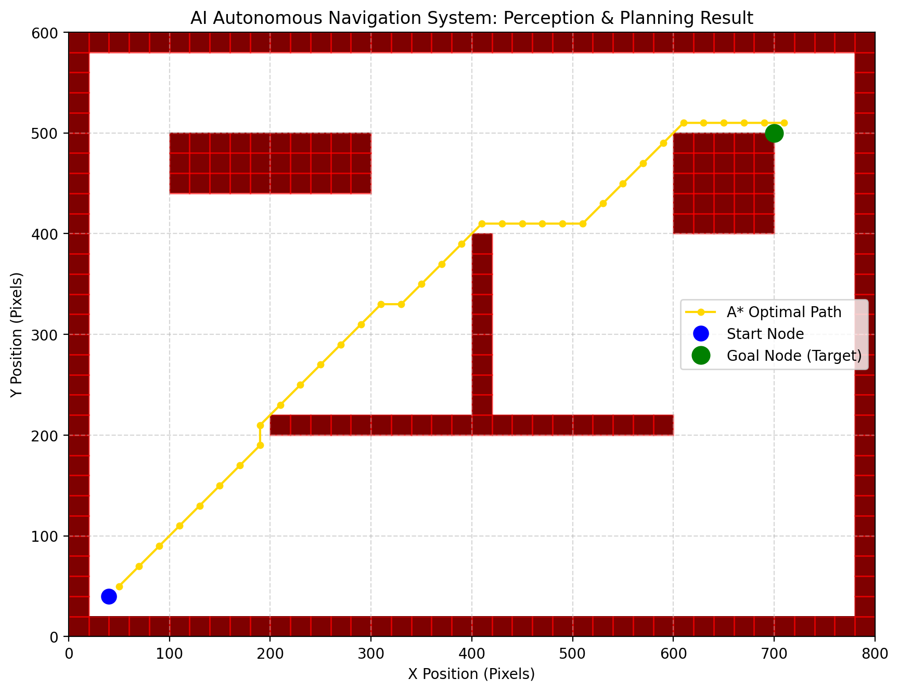

# 🚗 AI-Based Autonomous Navigation System

An end-to-end Python simulation demonstrating the core pillars of autonomous robotics: **Perception (LiDAR)**, **Path Planning (A*)**, and **Control (Pure Pursuit)**. 

Built in a continuous 2D Pygame environment, this project simulates how autonomous vehicles and warehouse robots navigate complex environments without human intervention.

## 🌟 Project Overview
Navigating a machine from Point A to Point B safely requires breaking down the problem into three pieces:
1.  **Perception:** "What is around me?" simulated via 360-degree Raycasting.
2.  **Planning:** "How do I get there?" calculated using the A-Star (A*) Graph Search algorithm.
3.  **Control:** "How do I move my motors?" guided by a Pure Pursuit lookahead kinematic controller.

### 💼 Industry Relevance
This tech stack models the foundational logic utilized daily by industry leaders like Waymo, Tesla, DJI, and Amazon Robotics to enable self-driving cars, delivery drones, and autonomous warehouse operations.

---

## 🛠️ Folder Structure
```text
AI-Autonomous-Navigation-System/
├── docs/                      # Extensive guides, interview questions, architecture models
│   └── Project_Guide.md 
├── src/                       # Source Code Modules
│   ├── perception.py          # LiDAR Raycasting math
│   ├── path_planning.py       # A* Heuristic Search
│   ├── controller.py          # Pure Pursuit kinematics
│   └── simulation.py          # Pygame Map & Rendering
├── main.py                    # Brain module tying Perception -> Plan -> Control
├── requirements.txt           # Python Dependencies
└── README.md                  
```

---


### Simulation Workflow (What you will see)
1.  **Initialization:** The map, boundaries, and internal walled obstacles are rendered instantly.
2.  **Global Planning Phase:** The terminal will display `Planning initial path...`. It discretizes the space and runs A* from `(40, 40)` to `(700, 500)`.
3.  **Start:** The autonomous vehicle (green dot) appears. Yellow line represents the solved optimal path.
4.  **Perception Loop:** Faint blue rays cast dynamically from the vehicle, simulating LiDAR intersecting walls.
5.  **Control Loop:** The vehicle smoothly alters its heading/angle to target waypoints along the yellow line.
6.  **Success:** Vehicle reaches destination and window safely closes.

---

## 📸 Screenshots & Proof of Work

Here is the successfully plotted A* optimal routing avoiding our programmed constraints:


---

## 🚀 Future Enhancements
*   **Dynamic Window Approach (DWA):** Add moving obstacles and enable the controller to generate local trajectories to evade them in real time.
*   **Computer Vision (OpenCV):** Instead of feeding the grid directly from memory, feed a top-down camera view to an OpenCV node to detect walls via `cv2.Canny()` edge detection.
*   **ROS 2 Porting:** Upgrade the modules into independent Publisher/Subscriber nodes.

---
*Created as part of a technical portfolio pipeline demonstrating Python and Algorithmic robotic competencies.*
